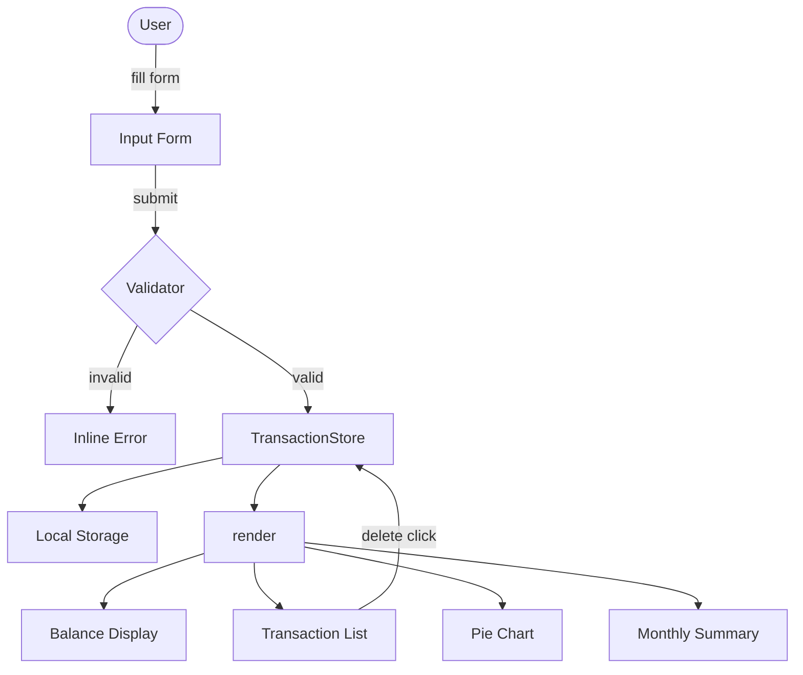

# Design Document: Expense & Budget Visualizer

## Overview

The Expense & Budget Visualizer is a single-page, mobile-first web application that runs entirely in the browser without any backend, build tooling, or JavaScript framework. Users record daily spending transactions (item name, amount, category), view them in a scrollable list, track a running total balance, and visualize spending distribution via a Chart.js pie chart. All data is persisted in the browser's Local Storage so the history survives page refreshes and tab closures.

### Key Design Principles

- **Zero dependencies (except Chart.js)** — vanilla HTML/CSS/JS only, openable from the file system.
- **Single-file per type** — one `index.html`, one `css/styles.css`, one `js/app.js`.
- **Reactive UI state** — every mutation (add/delete) triggers a unified render pass that updates the list, balance, chart, and optional views atomically.
- **Graceful degradation** — if Local Storage is unavailable or corrupt, the app starts clean with a non-blocking warning.

---

## Architecture

### High-Level Structure

```
index.html                  # Shell; loads CSS + Chart.js CDN + app.js
css/
  styles.css                # All styles; CSS custom properties for theming
js/
  app.js                    # All application logic
```

### Module Responsibilities (within `app.js`)

```
app.js
├── StorageManager          # Read / write / parse Local Storage
├── TransactionStore        # In-memory array; single source of truth
├── Validator               # Input validation rules
├── BalanceController       # Computes and renders balance
├── TransactionListRenderer # Renders transaction list DOM
├── ChartController         # Owns Chart.js instance, updates on data change
├── MonthlySummaryRenderer  # (Optional) Groups transactions by month
├── SortController          # (Optional) Manages sort state
├── ThemeController         # (Optional) Manages dark/light theme
└── App                     # Bootstraps all modules, wires event listeners
```

### Data Flow

```
User Action (submit / delete / sort / theme)
        │
        ▼
  Validator (on submit)
        │  valid
        ▼
  TransactionStore.mutate()
        │
        ▼
  StorageManager.save()
        │
        ▼
  render()  ──► BalanceController.update()
            ──► TransactionListRenderer.update()
            ──► ChartController.update()
            ──► MonthlySummaryRenderer.update()  (if enabled)
```

All rendering is triggered by a single `render()` function, ensuring consistency across all views.

### Mermaid Diagram



---

## Components and Interfaces

### 1. Input Form

**HTML elements:**
- `<input type="text" id="item-name">` — item name
- `<input type="number" id="amount" min="0.01" step="0.01">` — positive numeric amount
- `<select id="category">` — options: Food, Transport, Fun
- `<button id="add-btn">` — submit
- `<p id="form-error" aria-live="polite">` — inline error message

**Public interface (JS):**
```js
resetForm()         // Clears all fields after successful submission
showError(message)  // Populates and shows #form-error
clearError()        // Hides #form-error
```

### 2. Validator

```js
/**
 * @param {string} name
 * @param {string|number} amount
 * @param {string} category
 * @returns {{ valid: boolean, errors: string[] }}
 */
validate(name, amount, category)
```

Rules:
- `name.trim().length > 0`
- `parseFloat(amount) > 0` and is finite
- `category` is one of `['Food', 'Transport', 'Fun']`

### 3. TransactionStore

```js
// In-memory array of Transaction objects
let transactions = []

add(transaction)        // Appends and triggers save + render
remove(id)              // Filters by id, triggers save + render
getAll()                // Returns shallow copy of array
getTotalBalance()       // Sum of all amounts
getTotalsByCategory()   // { Food: n, Transport: n, Fun: n }
getGroupedByMonth()     // { 'YYYY-MM': Transaction[] }
getSorted(direction)    // Sorted copy: 'asc' | 'desc' by amount
```

### 4. StorageManager

```js
const STORAGE_KEY = 'expense_transactions'
const THEME_KEY   = 'expense_theme'

save(transactions)           // JSON.stringify → localStorage.setItem
load()                       // JSON.parse ← localStorage.getItem; returns [] on error
saveTheme(theme)             // 'dark' | 'light'
loadTheme()                  // Returns saved theme or 'light'
```

### 5. BalanceController

```js
render(balance)   // Updates #balance-display with formatted currency
```

### 6. TransactionListRenderer

```js
render(transactions)   // Rebuilds #transaction-list via DocumentFragment
```

Each list item markup:
```html
<li class="transaction-item" data-id="{id}">
  <span class="item-name">{name}</span>
  <span class="item-category category--{category}">{category}</span>
  <span class="item-amount">{formatted amount}</span>
  <button class="delete-btn" aria-label="Delete {name}">✕</button>
</li>
```

### 7. ChartController

```js
init(canvasId)                    // Creates Chart.js instance
update(totalsByCategory)          // Updates chart data and calls chart.update()
showPlaceholder()                 // Renders placeholder when no data exists
```

Chart.js configuration:
- Type: `'pie'`
- Colors: Food → `#FF6384`, Transport → `#36A2EB`, Fun → `#FFCE56`
- Legend position: `'bottom'`
- Responsive: `true`, `maintainAspectRatio: false`

### 8. MonthlySummaryRenderer (Optional)

```js
render(groupedByMonth)   // Renders monthly totals in #monthly-summary
```

### 9. SortController (Optional)

```js
getDirection()          // 'asc' | 'desc' | null
toggle()                // Cycles through asc → desc → null
```

### 10. ThemeController (Optional)

```js
apply(theme)     // Sets data-theme attribute on <html>; saves to Storage
toggle()         // Flips between 'dark' and 'light'
init()           // Loads and applies saved theme on startup
```

CSS custom properties (in `styles.css`):
```css
:root[data-theme="light"] { --bg: #fff; --text: #111; … }
:root[data-theme="dark"]  { --bg: #1a1a2e; --text: #eee; … }
```

---

## Data Models

### Transaction Object

```js
/**
 * @typedef {Object} Transaction
 * @property {string} id           - UUID-style unique ID (crypto.randomUUID or Date.now + Math.random)
 * @property {string} name         - Item name (non-empty, trimmed)
 * @property {number} amount       - Positive decimal number
 * @property {string} category     - 'Food' | 'Transport' | 'Fun'
 * @property {string} createdAt    - ISO 8601 timestamp (new Date().toISOString())
 */
```

### Local Storage Schema

```
Key:   "expense_transactions"
Value: JSON array of Transaction objects

Example:
[
  {
    "id": "1717600000000-0.123",
    "name": "Lunch",
    "amount": 12.50,
    "category": "Food",
    "createdAt": "2024-06-05T12:00:00.000Z"
  }
]

Key:   "expense_theme"
Value: "light" | "dark"
```

### CategoryTotals Object

```js
/**
 * @typedef {Object} CategoryTotals
 * @property {number} Food
 * @property {number} Transport
 * @property {number} Fun
 */
```

---

## Correctness Properties

*A property is a characteristic or behavior that should hold true across all valid executions of a system — essentially, a formal statement about what the system should do. Properties serve as the bridge between human-readable specifications and machine-verifiable correctness guarantees.*

### Property 1: Valid transaction is added and retrievable

*For any* valid transaction (non-empty name, positive amount, valid category), after calling `TransactionStore.add(transaction)`, the store's `getAll()` result SHALL contain a transaction with the same name, amount, and category.

**Validates: Requirements 1.4, 2.1**

### Property 2: Whitespace-only names are rejected

*For any* string composed entirely of whitespace characters (spaces, tabs, newlines), the `Validator.validate()` function SHALL return `{ valid: false }` and the transaction list SHALL remain unchanged.

**Validates: Requirements 1.2, 1.3**

### Property 3: Balance equals sum of all transaction amounts

*For any* sequence of add and delete operations, the value returned by `TransactionStore.getTotalBalance()` SHALL equal the arithmetic sum of `amount` fields across all currently stored transactions.

**Validates: Requirements 3.1, 3.2, 3.3, 3.4**

### Property 4: Delete removes transaction permanently

*For any* transaction currently in the store, after calling `TransactionStore.remove(id)`, the store's `getAll()` result SHALL not contain any transaction with that id.

**Validates: Requirements 2.4**

### Property 5: Category totals are consistent with transaction list

*For any* set of stored transactions, `TransactionStore.getTotalsByCategory()` SHALL return an object where each category value equals the sum of amounts of all transactions in that category, and the sum of all category values equals the total balance.

**Validates: Requirements 4.1, 4.2**

### Property 6: Local Storage round-trip preserves transaction data

*For any* array of transaction objects, serializing via `StorageManager.save()` then deserializing via `StorageManager.load()` SHALL produce an array that is deeply equal to the original (same ids, names, amounts, categories, timestamps).

**Validates: Requirements 5.1, 5.2, 5.3**

### Property 7: Negative or zero amounts are rejected

*For any* amount value that is zero, negative, non-numeric, or empty, `Validator.validate()` SHALL return `{ valid: false }`.

**Validates: Requirements 1.2, 1.3**

### Property 8: Sort order invariant

*For any* list of transactions sorted in ascending order, every adjacent pair `(a, b)` SHALL satisfy `a.amount <= b.amount`; in descending order `a.amount >= b.amount`.

**Validates: Requirements 10.1, 10.2**

### Property 9: Monthly grouping covers all transactions

*For any* set of stored transactions, the union of all transaction arrays in `TransactionStore.getGroupedByMonth()` SHALL contain exactly the same transactions as `getAll()` (no duplicates, no omissions).

**Validates: Requirements 9.1, 9.2**

### Property 10: Theme persistence round-trip

*For any* theme value (`'light'` or `'dark'`), saving via `StorageManager.saveTheme(theme)` then loading via `StorageManager.loadTheme()` SHALL return the same theme value.

**Validates: Requirements 11.3**

---

## Error Handling

### Validation Errors (User-Facing)

| Condition | Behavior |
|-----------|----------|
| Empty item name | Inline error: "Please enter an item name." |
| Amount ≤ 0 or non-numeric | Inline error: "Please enter a positive amount." |
| No category selected | Inline error: "Please select a category." |

All errors are shown in `#form-error` (aria-live region) and cleared on the next successful submission or when the user begins editing.

### Storage Errors

| Condition | Behavior |
|-----------|----------|
| `localStorage` unavailable (private mode, quota exceeded) | App starts with empty list; non-blocking toast/banner: "Storage unavailable — changes will not persist." |
| `JSON.parse` fails on stored data | Same as above — treats as empty, logs warning to console. |
| Malformed transaction fields on load | Per-record: skip malformed records, continue with valid ones; log warning. |

### Chart Errors

| Condition | Behavior |
|-----------|----------|
| No transactions | Chart shows placeholder: "No spending data yet." text overlay; chart canvas hidden or renders with zero-value. |
| Chart.js CDN unreachable | App remains functional without chart; `#chart-container` shows fallback text. |

### ID Generation

`crypto.randomUUID()` is used where available (Chrome 92+, Firefox 95+, Safari 15.4+). Falls back to `Date.now().toString(36) + Math.random().toString(36).slice(2)` for older browsers.

---

## Testing Strategy

### Unit Tests

Focus on pure logic modules that are framework-independent. Recommended framework: **Jest** (can be run via Node without a browser).

| Test Target | What to Test |
|-------------|-------------|
| `Validator.validate()` | Valid inputs pass; empty name, zero/negative/NaN amount, invalid category all fail |
| `TransactionStore.getTotalBalance()` | Empty → 0; single item; multiple items; after deletion |
| `TransactionStore.getTotalsByCategory()` | Correct sums per category; categories absent from data return 0 |
| `TransactionStore.getGroupedByMonth()` | Correct grouping; multiple months; single month |
| `StorageManager.save/load` | Round-trip fidelity; malformed JSON returns [] |
| `StorageManager.saveTheme/loadTheme` | Round-trip for both theme values; default 'light' when absent |

### Property-Based Tests

Recommended library: **[fast-check](https://fast-check.io/)** (works with Jest, no browser required).

Each property test runs a minimum of **100 iterations**.

Tag format: `// Feature: expense-budget-visualizer, Property N: <property text>`

| Property | Generator Strategy |
|----------|-------------------|
| **Property 1** — Valid transaction add/retrieve | Generate arbitrary `{name: nonEmpty string, amount: positive float, category: one of enum}` |
| **Property 2** — Whitespace names rejected | Generate strings from `fc.stringOf(fc.constantFrom(' ', '\t', '\n'))` |
| **Property 3** — Balance = sum of amounts | Generate sequences of add/delete operations; assert after each mutation |
| **Property 4** — Delete removes by id | Generate store state, pick random id, delete, assert absent |
| **Property 5** — Category totals consistent | Generate multi-category transaction sets; assert per-category sums and total |
| **Property 6** — Storage round-trip | Generate array of valid Transaction objects; save then load; deep equal |
| **Property 7** — Invalid amounts rejected | Generate 0, negatives, NaN, Infinity, strings via `fc.oneof(...)` |
| **Property 8** — Sort order | Generate unsorted list; sort asc/desc; assert adjacent-pair invariant |
| **Property 9** — Monthly grouping covers all | Generate transactions across multiple months; assert union = all |
| **Property 10** — Theme round-trip | Generate `fc.constantFrom('light', 'dark')`; save then load |

### Integration / Smoke Tests

Manual browser checklist (no automated runner needed for these):

- Open `index.html` directly from file system → app loads and shows zero balance.
- Add a transaction → appears in list, balance updates, chart updates.
- Reload page → transactions restored from Local Storage.
- Delete a transaction → list, balance, chart all update.
- Resize viewport to 320px → no horizontal scroll, all controls usable.
- Toggle dark/light theme → all components update; reload → theme persists.

### Accessibility Checks

- All interactive elements have `aria-label` or visible label.
- `#form-error` is an `aria-live="polite"` region.
- Delete buttons include `aria-label="Delete {name}"`.
- Chart has `role="img"` with `aria-label` describing the chart.
- Minimum touch target size 44×44 CSS pixels on all interactive controls.
